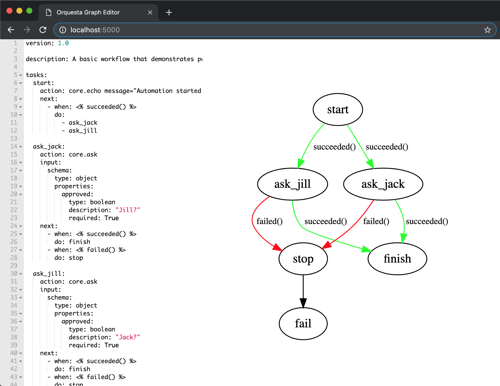

# Rehearsal
#### rehearsal is a dockerized mini web app written in written in flask and react to help you edit [orquesta](https://github.com/StackStorm/orquesta) workflow files in the browser and visualize the corresponding graph


### Quickstart
*prerequisites: install docker and docker-compose on your machine*
```
git clone git@github.com:trstruth/rehearsal.git
cd rehearsal
git submodule init && git submodule update
make up
```
Point a browser at localhost:5000 and you should see a yaml editor.  Paste your favorite orquesta workflow definition into the editor and wait for a second or two.

### General
Rehearsal is a lightweight flask app that can help you develop orquesta workflows.  Sanity check your workflows by reviewing the directed graph composed from your yaml definition.  This tight feedback loop can help cut down on workflow development time, and sharing the high level flowchart of a workflow can help others quickly build a mental model of your workflow logic.


The orquesta source code is bind mounted as `./image/orquesta:/orquesta` and pip installed inside the container with the [`-e`](https://pip.pypa.io/en/stable/reference/pip_install/#editable-installs) flag.  This means that you can edit the orquesta source code on your host machine and see how it affects the composed graph.  People contributing to orquesta may find this useful.

Rehearsal is dockerized because the installation of its dependencies (namely pygraphviz) gave me some issues that I didn't want other people to try to deal with.  I think people who have worked with stackstorm's [official docker container](https://github.com/StackStorm/st2-docker/) will find the structure of this repo to be fairly familiar.

### Further Reading
- If you're interested in the frontend, read the [editor](https://github.com/trstruth/rehearsal/blob/master/image/web/src/Editor.jsx) code
- If you want to know how the graph is constructed, read the [flask](https://github.com/trstruth/rehearsal/blob/master/image/web/app.py) code
- If you *really* want to know how the graph is constructed, read the [orquesta](https://github.com/StackStorm/orquesta) source code

### Disclaimer/Misc
I hacked this together as a developer tool for myself and my team.  We've gotten some great use out of it and want to share it with the community.  Issues, forks, feature requests, pull requests, constructive critcism, comments and stars are all welcome.
